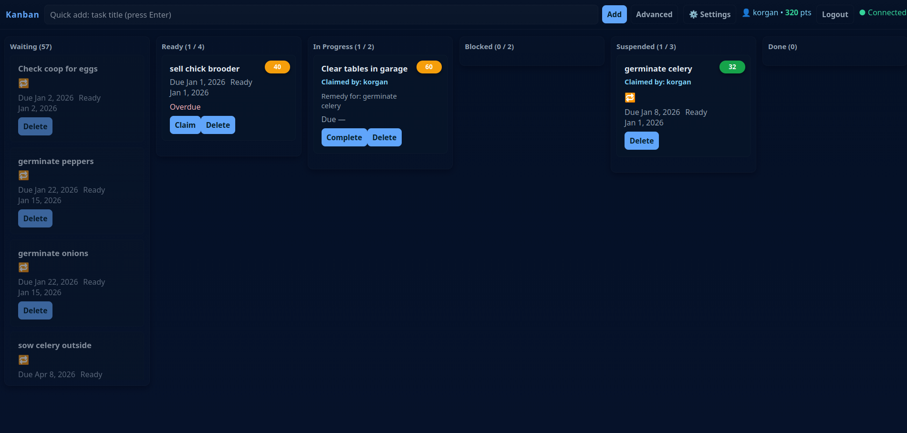

# Kanban Board



This is a shared task board for keeping track of what needs doing, what is in
progress, what is blocked, and what is done.

It is more than a basic kanban board. It also handles repeating tasks,
dependencies, due dates, automatic readiness, live updates, and a few other
useful behaviors that help the board act more like a lightweight task system
than a simple set of columns.

It is meant to be practical, not fancy. Open it in a browser, log in, and use
it like a live household or project board.

## What It Does

- lets multiple people use the same board at the same time
- updates live when someone changes a task
- supports repeating tasks
- supports task dependencies
- moves scheduled tasks into `Ready` automatically when their time comes
- warns when work piles up in a column
- keeps task data in local JSON files instead of a database

## The Columns

- `Waiting`
  The task exists, but it is not ready yet.
- `Ready`
  The task can be started.
- `In Progress`
  Someone is actively working on it.
- `Blocked`
  Work cannot continue right now.
- `Suspended`
  The task is paused, often because a dependency is not done yet.
- `Done`
  The task is finished.

## Common Ways To Use It

### Add a task

- Type a short title into the quick-add box and press Enter.
- If you need more detail, use the advanced editor.

### Move a task

- Drag it to another column.
- Or use task buttons like claim or complete.

### Edit a task

- Click the task card.
- You can change the title, notes, due date, recurrence, and dependencies.

### Blocked tasks

- If a task is blocked, you can create a remedy task for it.
- This is useful when the real next action is “solve the thing stopping this.”

### Repeating tasks

- A repeating task can recreate itself after completion.
- `Rolling` repeats from when you finished it.
- `Anchored` repeats based on the calendar.

### Dependencies

- A task can depend on another task.
- If its dependency is not done, it will stay suspended.
- If you delete a task that other tasks depend on, the board will warn you
  first and ask for confirmation.

## First-Time Setup

You need Node.js and npm installed.

1. Clone the repo.
2. Go into the server folder.
3. Install dependencies.
4. Start the server.
5. Open the board in your browser.

```bash
git clone <repository-url>
cd kanban/server
npm install
node index.js
```

Then open:

`http://localhost:3000`

## Logging In

The first time you use the board:

1. Open the site.
2. Click `Register`.
3. Make a username and password.
4. Log in.

After that, just log in normally.

## Everyday Use

The simplest flow is:

1. Put future or not-yet-ready work on the board.
2. Move tasks into `Ready` when they can be done.
3. Claim work by moving it into `In Progress`.
4. Mark it `Done` when finished.
5. If something gets stuck, mark it `Blocked` or create a remedy task.

## Due Dates And Readiness

- A task can have a due date.
- A task can also have a lead time.
- Tasks with due dates move into `Ready` automatically when they become due.
- Lead time means “make this ready a few days before it is actually due.”

Example:

- due Friday
- lead time 2 days

The task should become ready on Wednesday.

## Work-In-Progress Limits

You can set limits for how many tasks should sit in a column at once.

This does not stop you from adding more tasks, but it gives you a warning when
that column is overloaded.

## Where The Data Lives

The board stores its data in:

- `server/data/tasks.json`
- `server/data/users.json`
- `server/data/wip_limits.json`

That means the app is easy to back up and easy to inspect.

## Important Files

- `server/index.js`
  Main server file.
- `server/static/index.html`
  Main board interface.
- `server/static/login.html`
  Login and registration page.
- `server/data/`
  Stored data.

## If You Want To Run It On Another Port

You can set environment variables like:

```bash
PORT=3000
SESSION_SECRET=change-this
```

`SESSION_SECRET` should be changed if this is anything other than casual local
use.

## Plain-English Notes About How It Works

- The board recalculates task priority automatically.
- Tasks closer to being due tend to rise.
- Tasks that unblock other tasks also tend to rise.
- Repeating tasks make new future instances when completed.
- Live updates are sent to connected browsers so everyone sees changes quickly.

You do not need to understand the internal scoring system to use the board.

## Backup

If you want a simple backup, copy the repo folder or archive it.

Example:

```bash
tar -czf kanban-backup-$(date +%Y%m%d).tar.gz --exclude=node_modules kanban/
```

## In Short

This board is for:

- capturing work
- keeping the next tasks visible
- showing what is blocked
- avoiding forgotten dependencies
- making repeat work less annoying
