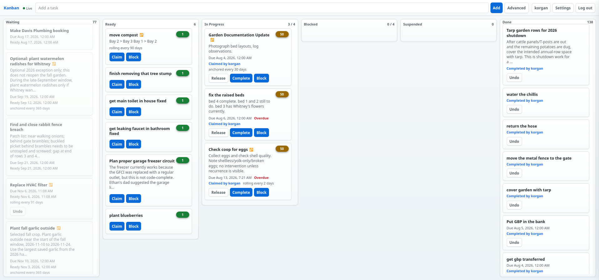

# Kanban



Kanban is a small task board for keeping track of work without turning task
management into a project of its own.

It runs in a web browser, but the application and its data stay on the computer
where it is installed. It is useful for household work, gardening, personal
projects, maintenance, or any other collection of tasks that needs more
structure than a list.

## What It Does

- Sorts available work automatically so important tasks rise to the top.
- Moves scheduled tasks into Ready when it is time to start them.
- Supports repeating tasks, including fixed calendar schedules and selected
  weekdays.
- Keeps tasks suspended until their dependencies are finished.
- Records why a task is blocked and can create a separate remedy task.
- Limits how much work can be in progress at once.
- Shows overdue and time-critical work clearly.
- Keeps completion history and allows an accidental completion to be undone.
- Shows completion activity in a one-year heatmap.
- Updates open boards when another user makes a change.

## The Columns

| Column | Meaning |
| --- | --- |
| **Waiting** | The task is scheduled for later and is not ready yet. |
| **Ready** | The task can be started. |
| **In Progress** | Someone has claimed the task and is working on it. |
| **Blocked** | Work cannot continue until a problem is resolved. |
| **Suspended** | A dependency is unfinished or the task's recurrence is paused. |
| **Done** | The task has been completed. |

Waiting and Suspended are managed automatically. Ready, In Progress, Blocked,
and Done represent actions taken by the user.

## Everyday Use

1. Add a task using the box at the top of the board.
2. Use **Advanced** when the task needs a description, date, recurrence, or
   dependencies.
3. Claim a Ready task when you begin working on it.
4. Complete it when the work is finished.
5. Block it and save a note when work cannot continue.

Click any card to see or edit all of its details. The board automatically sorts
each column, so the task most in need of attention appears near the top.

## Installing Kanban

### Windows 10 or 11

The Windows package is for 64-bit Windows and does not require Go, Git, a
terminal, or administrator access.

1. Download `Kanban-Setup-windows-amd64.exe`.
2. Double-click it and approve the Windows security prompt if one appears.
3. Kanban opens in the default browser. Create the first username and password.

The installer creates Desktop and Start Menu shortcuts and starts Kanban
automatically when that Windows user signs in. Opening either shortcut brings
the board up in the default browser. The app remains local to that computer and
listens only on `127.0.0.1`.

Early local builds are not code-signed, so Windows SmartScreen may require
**More info** followed by **Run anyway**. A signing certificate is required to
remove that warning reliably.

Uninstall Kanban through **Settings > Apps > Installed apps**. Uninstalling
preserves the task database so a later reinstall can restore the board.

### Linux Requirements

- A Linux system that uses systemd
- [Go 1.26.5 or newer](https://go.dev/dl/)
- Git

### Linux Installation

Open a terminal and run:

```bash
git clone https://github.com/korganrivera/kanban.git
cd kanban
./scripts/install-service.sh
```

The installation script:

- builds Kanban
- starts it automatically when the Linux user logs in
- restarts it if it crashes
- creates a local database
- creates an initial backup and schedules local backups every six hours

Open <http://127.0.0.1:3100> in a browser. On the first visit, create the first
username and password. Public account registration is disabled after the first
account is created.

## Starting And Stopping

The installer creates a background user service.

```bash
systemctl --user start kanban-go.service
systemctl --user stop kanban-go.service
systemctl --user restart kanban-go.service
```

To check whether it is running:

```bash
systemctl --user status kanban-go.service
```

## Updating

Automatic application updates are not available yet.

On Windows, run the newer setup executable. It replaces the application while
keeping the existing account, tasks, settings, completion history, and backups.

On Linux, open a terminal in the Kanban folder and run:

```bash
systemctl --user start kanban-go-backup.service
git pull --ff-only
./scripts/install-service.sh
systemctl --user restart kanban-go.service
```

The first command makes a backup before changing the application. Updates keep
the existing account, tasks, settings, and completion history.

## Data And Backups

On Windows, the live database and diagnostic log are stored at:

```text
%LOCALAPPDATA%\Kanban\data\kanban.db
%LOCALAPPDATA%\Kanban\kanban.log
```

Windows creates an audited backup at startup and every six hours, retaining the
latest 30 under:

```text
%LOCALAPPDATA%\Kanban\backups
```

On a source-installed Linux system, the live database is stored at:

```text
data/kanban.db
```

Linux automatic backups are stored at:

```text
~/.local/state/kanban-go/backups
```

Do not delete the Kanban folder without first preserving the database. Local
backups protect against mistakes and database damage, but they do not protect
against losing the entire computer or disk. Copy backups to another device or
trusted storage location regularly.

Restore instructions are in [systemd/README.md](systemd/README.md).

## Privacy And Network Access

By default, Kanban listens only on `127.0.0.1`, which means it is available only
on the computer running it. Task data is not sent to a hosted Kanban service.

Making the board available to other computers requires additional HTTPS and
network configuration. Do not expose the application directly to the internet
without that protection.

## Technical Documentation

- [Service, backup, and restore operations](systemd/README.md)
- [Migration and rollback information](MIGRATION.md)
- [Feature-parity review](PARITY_REVIEW.md)

Developers can run the application without installing the service:

```bash
go run ./cmd/kanban
```

Run the automated tests with:

```bash
go test ./...
```

Build the Windows installer and portable executable from Linux or macOS with:

```bash
./scripts/build-windows.sh
```

The build uses Go's Windows cross-compiler and writes the single-file installer,
portable fallback, and SHA-256 checksums to `dist/windows/`.
